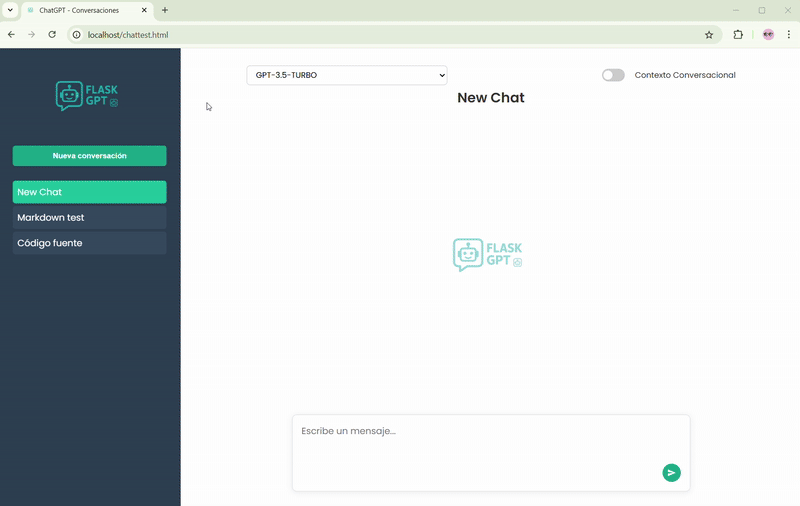

# ChatGPT Pay-As-You-Go Web App

**Purpose:**

This project provides a self-hosted web interface to use OpenAI's ChatGPT models in a "pay-as-you-go" fashion via the official API. If you want access to all available GPT models without being tied to a fixed monthly subscription, this application is for you. You pay only for what you use, with no time limits or quotas, leveraging your own OpenAI API key. The app is ideal for users who want flexibility, full model availability, and cost control for personal or small-team usage.

**See it in action:**
Interact with ChatGPT models, switch context, and manage conversations — all in one place.



---

## 📁 Project Structure

```
chatgpt_flask/
│
├── backend/                 # Flask backend (API, DB, business logic)
│   ├── app.py
│   └── chatgpt_api/
│       ├── api/
│       │   ├── contexto.py
│       │   ├── conversacion.py
│       │   ├── mensaje.py
│       │   ├── modelo.py
│       │   └── tools.py
│       ├── db.py
│       ├── db_init/
│       │   ├── add_modelo_a_conversacion_SQL.py
│       │   ├── crear_db.py
│       │   ├── crear_db_con_modelo.py
│       │   └── verificar_db.py
│       ├── models.py
│       └── services/
│           └── openai_service.py
│
├── frontend/                # Static frontend (HTML, JS, CSS, SCSS, images)
│   ├── web/
│   │   ├── chattest.html
│   │   └── static/
│   │       ├── css/
│   │       │   ├── main.css
│   │       │   └── main.min.css
│   │       ├── images/
│   │       │   ├── favicon.ico
│   │       │   └── flaskchat-logo.png
│   │       ├── js/
│   │       │   ├── main.js
│   │       │   └── modules/
│   │       │       ├── api.js
│   │       │       ├── conversation.js
│   │       │       ├── events.js
│   │       │       └── ui.js
│   └── scss/
│
├── docs/                    # Documentation (Doxygen, etc.)
│
└── ...
```

---

## 🚀 Backend (Flask API)

### **Requirements**
- Python 3.8+
- Virtual environment with dependencies installed (see `requirements.txt`)
- OpenAI API Key

### **Setup**

1. **Clone the repository and enter the backend directory:**
   ```bash
   cd chatgpt_flask/backend
   ```

2. **Create and activate a Python virtual environment:**
   ```bash
   python -m venv venv
   source venv/bin/activate  # On Windows: venv\Scripts\activate
   ```

3. **Install dependencies:**
   ```bash
   pip install -r requirements.txt
   ```

4. **Initialize the SQLite database:**
   - Inside `chatgpt_api/db_init/` you will find scripts to create or update the DB schema.
   - To initialize the DB:
     ```bash
     cd chatgpt_api/db_init
     python crear_db_con_modelo.py
     ```
   - To verify tables:
     ```bash
     python verificar_db.py
     ```
   - To add the `modelo` column if missing:
     ```bash
     python add_modelo_a_conversacion_SQL.py
     ```

5. **Set the OpenAI API Key:**
   - The backend expects the environment variable `OPENAI_API_KEY` to be set.
   - You can export it manually or use a process manager (see below).

### **Running as a Service (Recommended for Production)**

A sample `systemd` service file is provided as follows:

Example configuration (`/etc/systemd/system/flaskchat.service`):

```ini
[Unit]
Description=Flask ChatGPT API Service
After=network.target

[Service]
User=youruser
WorkingDirectory=/path/to/chatgpt_flask/backend
ExecStart=/path/to/chatgpt_flask/backend/venv/bin/python /path/to/chatgpt_flask/backend/app.py
Environment=OPENAI_API_KEY=your-openai-api-key
Restart=always
RestartSec=3

[Install]
WantedBy=multi-user.target
```

Enable and start the service:

```bash
sudo systemctl daemon-reload
sudo systemctl enable flaskchat
sudo systemctl start flaskchat
```

---

## 🖥️ Frontend (Static Web)

- All frontend files are under `frontend/web/` (HTML, JS, CSS, images).
- SCSS sources are in `frontend/scss/` and should be compiled to CSS as needed.
- The frontend can be served by **any web server** (e.g., Apache, Nginx, Caddy, etc).

### **Reverse Proxy Configuration**

The frontend communicates with the Flask API (backend) via HTTP requests.  
You **must** configure your web server as a reverse proxy to forward API calls.

#### **Example (Apache VirtualHost):**

```apache
# Proxy settings for Flask application
ProxyPass /api/ http://localhost:5000/api/
ProxyPassReverse /api/ http://localhost:5000/api/
```
Place this inside your relevant `<VirtualHost>` block.

- Adjust the URL and port (`localhost:5000`) to match your Flask backend.
- Make sure `mod_proxy` and `mod_proxy_http` are enabled in Apache.

---

## 🗄️ Database Initialization

- All scripts for initializing and updating the SQLite database are in `backend/chatgpt_api/db_init/`.
- See the **Backend Setup** section for usage.

---

## 📄 Documentation

- Doxygen-generated documentation and other docs are in the `docs/` directory.

---

## 🛡️ Security Notes

- **Never commit your OpenAI API key or other secrets to the repository.**
- Use environment variables or secure secret managers for sensitive information.

---

## ✨ Credits

Developed by Rafael Sanchez, 2025.
